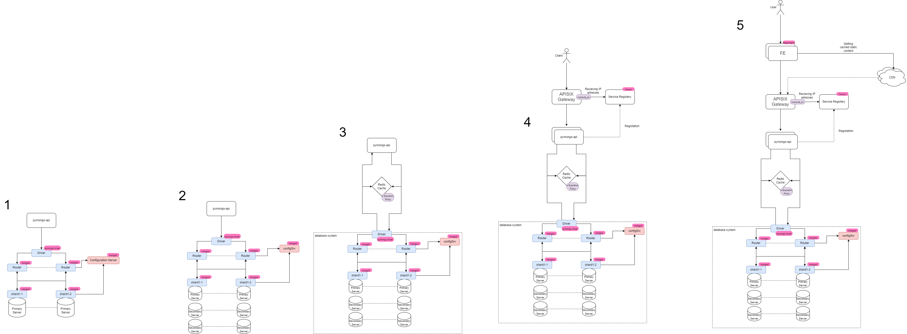

# Настройка шардирования, репликации и кеширования MongoDB

Этот проект демонстрирует, как настроить MongoDB в режиме шардирования с репликацией и кешированием с использованием Docker Compose. Данный README предоставляет пошаговые инструкции для инициализации шардированного кластера с двумя шардовыми репликационными наборами (каждый по 3 узла) и проверки работы приложения.

##  Диаграмма архитектуры



## Предварительные требования

- Установлены **Docker** и **Docker Compose**
- Директория проекта содержит:
  - `docker-compose.yaml` (с сервисами: `configSrv`, репликационными наборами для `shard1` и `shard2`, а также `mongos_router`)
  - Файлы приложения (`Dockerfile`, `app.py`)
- Установлены переменные окружения для:
  - `MONGODB_URL`
  - `MONGODB_DATABASE_NAME`

> **Примечание:** В данном проекте для каждого шарда настроено 3 реплики:
> - **Shard1:** `shard1-1`, `shard1-2`, `shard1-3`
> - **Shard2:** `shard2-1`, `shard2-2`, `shard2-3`

## Шаг 1: Запуск контейнеров

Поднимите все сервисы с помощью команды:

```bash
docker compose up -d
```

## Шаг 2: Инициализация сервера конфигурации

Подключитесь к серверу конфигурации и инициализируйте набор реплик в режиме конфигурационного сервера:

```bash
docker compose exec -T configSrv mongosh --port 27017 --quiet <<EOF
rs.initiate({
  _id : "config_server",
  configsvr: true,
  members: [
    { _id : 0, host : "configSrv:27017" }
  ]
});
EOF
```

## Шаг 3: Инициализация репликационного набора для Shard1

Настройте репликационный набор для Shard1 с тремя участниками. Выполните на первом узле:

```bash
docker compose exec -T shard1-1 mongosh --port 27018 --quiet <<EOF
rs.initiate({
  _id : "shard1",
  members: [
    { _id : 0, host : "shard1-1:27018" },
    { _id : 1, host : "shard1-2:27020" },
    { _id : 2, host : "shard1-3:27021" }
  ]
});
EOF
```

## Шаг 4: Инициализация репликационного набора для Shard2

Настройте репликационный набор для Shard2 с тремя участниками. Выполните на первом узле:

```bash
docker compose exec -T shard2-1 mongosh --port 27019 --quiet <<EOF
rs.initiate({
  _id : "shard2",
  members: [
    { _id : 0, host : "shard2-1:27019" },
    { _id : 1, host : "shard2-2:27022" },
    { _id : 2, host : "shard2-3:27023" }
  ]
});
EOF
```

## Шаг 5: Настройка маршрутизатора Mongos

Подключитесь к маршрутизатору mongos_router и добавьте шарды в кластер, затем включите шардирование базы данных и шардируйте коллекцию:

```bash
docker compose exec -T mongos_router mongosh --port 27020 --quiet <<EOF
sh.addShard("shard1/shard1-1:27018,shard1-2:27020,shard1-3:27021");
sh.addShard("shard2/shard2-1:27019,shard2-2:27022,shard2-3:27023");
sh.enableSharding("somedb");
sh.shardCollection("somedb.helloDoc", { "name" : "hashed" });
EOF
```

## Шаг 6: Наполнение тестовыми данными

Вставьте 1000 документов в коллекцию helloDoc базы данных somedb:

```bash
docker compose exec -T mongos_router mongosh --port 27020 --quiet <<EOF
use somedb;
for (var i = 0; i < 1000; i++) {
  db.helloDoc.insert({ age: i, name: "ly" + i });
}
print("Общее количество документов:", db.helloDoc.countDocuments());
EOF
```

После выполнения скрипта в выводе должна отображаться строка, подтверждающая, что в базе не менее 1000 документов.

## Шаг 7: Проверка распределения данных по шардам

### Проверка Шарда 1

Подключитесь к первому узлу Shard1 и выполните:

```bash
docker compose exec -T shard1-1 mongosh --port 27018 --quiet <<EOF
use somedb;
print("Shard1:", db.helloDoc.countDocuments());
EOF
```

### Проверка Шарда 2

Подключитесь к первому узлу Shard2 и выполните:

```bash
docker compose exec -T shard2-1 mongosh --port 27019 --quiet <<EOF
use somedb;
print("Shard2:", db.helloDoc.countDocuments());
EOF
```

Общее количество документов на шардах (сумма выводов для Shard1 и Shard2) должно составлять 1000.

## Шаг 8: Проверка статуса репликационных наборов

Для проверки, что в каждом наборе по 3 реплики, выполните на одном из узлов каждого репликационного набора:

### Репликационный набор Shard1

```bash
docker compose exec -T shard1-1 mongosh --port 27018 --quiet <<EOF
rs.status();
EOF
```

В выводе должно быть видно 3 участника в наборе shard1.

### Репликационный набор Shard2

```bash
docker compose exec -T shard2-1 mongosh --port 27019 --quiet <<EOF
rs.status();
EOF
```

В выводе должно быть видно 3 участника в наборе shard2.

## Шаг 9: Тестирование эндпоинтов приложения

После настройки кластера и наполнения базы тестовыми данными, запустите контейнер с приложением. Убедитесь, что переменные окружения в сервисе `app` (в вашем `docker-compose.yaml`) настроены следующим образом:

- `MONGODB_URL`: `mongodb://mongos_router:27020`
- `MONGODB_DATABASE_NAME`: `somedb`
- (Если используется кеширование) `REDIS_URL`: `redis://redis:6379`

Приложение будет доступно на порту 8080.

### Основные эндпоинты

#### Корневой эндпоинт

Запрос:
```bash
curl http://localhost:8080/
```

#### Эндпоинт для получения количества документов в коллекции

Запрос:
```bash
curl http://localhost:8080/helloDoc/count
```

Ожидаемый результат: JSON-объект с полем `items_count`, которое должно быть равно 1000.

#### Эндпоинт для получения списка пользователей

Запрос:
```bash
curl http://localhost:8080/helloDoc/users
```

**Важно**: Первый вызов данного эндпоинта будет выполняться с задержкой (около 1 секунды), так как в коде намеренно добавлен `time.sleep(1)` для имитации длительной операции и последующего кеширования. Второй и последующие вызовы должны выполняться быстро (менее 100 мс) благодаря Redis-кешу.

# Руководство по использованию скриптов MongoDB для шардирования (вторая версия)

Это руководство объясняет, как использовать предоставленные скрипты для настройки шардированного кластера MongoDB с репликацией и кешированием с использованием Docker Compose. Эти скрипты автоматизируют процесс, описанный в файле README.md.

## Обзор скриптов

Скрипты следует выполнять в числовом порядке:

1. `1-init-config.sh` - Инициализирует сервер конфигурации
2. `2-init-shard-1.sh` - Настраивает репликационный набор первого шарда
3. `3-init-shard-2.sh` - Настраивает репликационный набор второго шарда
4. `4-init-router.sh` - Настраивает маршрутизатор mongos и включает шардирование
5. `5-write-test-data.sh` - Заполняет базу данных тестовыми документами
6. `6-check-shard-1.sh` - Проверяет количество документов на первом шарде
7. `7-check-shard-2.sh` - Проверяет количество документов на втором шарде
8. `8-check-replica-shard-1.sh` - Проверяет статус репликационного набора первого шарда
9. `9-check-replica-shard-2.sh` - Проверяет статус репликационного набора второго шарда

## Предварительные требования

Перед запуском этих скриптов:
- Убедитесь, что установлены Docker и Docker Compose
- Убедитесь, что `compose.yaml` находится в том же каталоге, что и скрипты
- Установите необходимые переменные окружения (MONGODB_URL, MONGODB_DATABASE_NAME)

## Инструкции по использованию

### Шаг 1: Запуск контейнеров Docker

Сначала запустите все контейнеры, определенные в вашем `compose.yaml`:

```bash
docker compose up -d
```

### Шаг 2: Запуск скриптов по порядку

Сделайте скрипты исполняемыми и запустите их последовательно:

```bash
chmod +x scripts/*.sh
```

#### Инициализация сервера конфигурации
```bash
./scripts/1-init-config.sh
```
Этот скрипт инициализирует репликационный набор сервера конфигурации.

#### Инициализация Шарда 1
```bash
./scripts/2-init-shard-1.sh
```
Этот скрипт настраивает первый шард с тремя репликами.

#### Инициализация Шарда 2
```bash
./scripts/3-init-shard-2.sh
```
Этот скрипт настраивает второй шард с тремя репликами.

#### Настройка маршрутизатора и шардирования
```bash
./scripts/4-init-router.sh
```
Этот скрипт добавляет оба шарда в кластер, включает шардирование для базы данных и настраивает коллекцию для шардирования.

#### Наполнение тестовыми данными
```bash
./scripts/5-write-test-data.sh
```
Этот скрипт добавляет 1000 тестовых документов в шардированную коллекцию и отображает общее количество.

#### Проверка распределения данных

Проверка количества документов на Шарде 1:
```bash
./scripts/6-check-shard-1.sh
```

Проверка количества документов на Шарде 2:
```bash
./scripts/7-check-shard-2.sh
```

Сумма документов из обоих шардов должна равняться 1000.

#### Проверка статуса репликационных наборов

Проверка статуса репликации для Шарда 1:
```bash
./scripts/8-check-replica-shard-1.sh
```

Проверка статуса репликации для Шарда 2:
```bash
./scripts/9-check-replica-shard-2.sh
```

Каждый вывод должен показывать 3 участника в соответствующих репликационных наборах.

## Тестирование приложения

После успешного выполнения всех скриптов вы можете протестировать конечные точки приложения:

```bash
# Тестирование корневого эндпоинта
curl http://localhost:8080/

# Проверка количества документов
curl http://localhost:8080/helloDoc/count

# Получение списка пользователей (первый вызов будет медленным из-за преднамеренной задержки)
curl http://localhost:8080/helloDoc/users
```

## Устранение неполадок

Если какой-либо скрипт завершается с ошибкой:
1. Проверьте сообщение об ошибке
2. Убедитесь, что все контейнеры запущены (`docker compose ps`)
3. Просмотрите логи контейнеров (`docker compose logs [имя_сервиса]`)
4. Перезапустите с неудавшегося шага после устранения проблем

Для чистого перезапуска вы можете уничтожить окружение с помощью:
```bash
docker compose down -v
```
А затем начать заново с Шага 1.

## Примечание 

Это вторая версия процесса настройки MongoDB, которая использует автоматизированные скрипты вместо ручного выполнения команд. Скрипты значительно упрощают процесс настройки и снижают вероятность ошибок при вводе команд вручную.

# Настройка шардирования, репликации и кеширования MongoDB для Windows

Этот проект демонстрирует, как настроить MongoDB в режиме шардирования с репликацией и кешированием с использованием Docker Compose в среде Windows. Данное руководство предоставляет пошаговые инструкции для инициализации шардированного кластера с двумя шардовыми репликационными наборами (каждый по 3 узла) и проверки работы приложения.

## Предварительные требования

- Установлены **Docker Desktop для Windows**
- Настроен WSL 2 (Windows Subsystem for Linux) - рекомендуется для лучшей производительности Docker
- Директория проекта содержит:
  - `docker-compose.yaml` (с сервисами: `configSrv`, репликационными наборами для `shard1` и `shard2`, а также `mongos_router`)
  - Файлы приложения (`Dockerfile`, `app.py`)
- Установлены переменные окружения для:
  - `MONGODB_URL`
  - `MONGODB_DATABASE_NAME`

> **Примечание:** В данном проекте для каждого шарда настроено 3 реплики:
> - **Shard1:** `shard1-1`, `shard1-2`, `shard1-3`
> - **Shard2:** `shard2-1`, `shard2-2`, `shard2-3`

## Шаг 1: Запуск контейнеров

Откройте PowerShell или командную строку Windows и перейдите в директорию проекта. Затем выполните команду:

```powershell
docker-compose up -d
```

## Шаг 2: Инициализация сервера конфигурации

Подключитесь к серверу конфигурации и инициализируйте набор реплик в режиме конфигурационного сервера:

```powershell
docker exec -it configSrv mongosh --port 27017
```

В интерактивной оболочке mongosh выполните:

```javascript
rs.initiate({
  _id : "config_server",
  configsvr: true,
  members: [
    { _id : 0, host : "configSrv:27017" }
  ]
});
```

Для выхода из оболочки mongosh введите `.exit`

## Шаг 3: Инициализация репликационного набора для Shard1

Настройте репликационный набор для Shard1 с тремя участниками. Подключитесь к первому узлу:

```powershell
docker exec -it shard1-1 mongosh --port 27018
```

В интерактивной оболочке mongosh выполните:

```javascript
rs.initiate({
  _id : "shard1",
  members: [
    { _id : 0, host : "shard1-1:27018" },
    { _id : 1, host : "shard1-2:27020" },
    { _id : 2, host : "shard1-3:27021" }
  ]
});
```

Для выхода из оболочки mongosh введите `.exit`

## Шаг 4: Инициализация репликационного набора для Shard2

Настройте репликационный набор для Shard2 с тремя участниками. Подключитесь к первому узлу:

```powershell
docker exec -it shard2-1 mongosh --port 27019
```

В интерактивной оболочке mongosh выполните:

```javascript
rs.initiate({
  _id : "shard2",
  members: [
    { _id : 0, host : "shard2-1:27019" },
    { _id : 1, host : "shard2-2:27022" },
    { _id : 2, host : "shard2-3:27023" }
  ]
});
```

Для выхода из оболочки mongosh введите `.exit`

## Шаг 5: Настройка маршрутизатора Mongos

Подключитесь к маршрутизатору mongos_router:

```powershell
docker exec -it mongos_router mongosh --port 27020
```

В интерактивной оболочке mongosh выполните следующие команды для добавления шардов и настройки шардирования:

```javascript
sh.addShard("shard1/shard1-1:27018,shard1-2:27020,shard1-3:27021");
sh.addShard("shard2/shard2-1:27019,shard2-2:27022,shard2-3:27023");
sh.enableSharding("somedb");
sh.shardCollection("somedb.helloDoc", { "name" : "hashed" });
```

Для выхода из оболочки mongosh введите `.exit`

## Шаг 6: Наполнение тестовыми данными

Подключитесь к mongos_router и вставьте 1000 документов в коллекцию:

```powershell
docker exec -it mongos_router mongosh --port 27020
```

В интерактивной оболочке mongosh выполните:

```javascript
use somedb;
for (var i = 0; i < 1000; i++) {
  db.helloDoc.insert({ age: i, name: "ly" + i });
}
db.helloDoc.countDocuments();
```

Вы должны увидеть результат примерно 1000 документов.

Для выхода из оболочки mongosh введите `.exit`

## Шаг 7: Проверка распределения данных по шардам

### Проверка Шарда 1

Подключитесь к первому узлу Shard1:

```powershell
docker exec -it shard1-1 mongosh --port 27018
```

В интерактивной оболочке mongosh выполните:

```javascript
use somedb;
db.helloDoc.countDocuments();
```

Запомните это число и выйдите с помощью `.exit`

### Проверка Шарда 2

Подключитесь к первому узлу Shard2:

```powershell
docker exec -it shard2-1 mongosh --port 27019
```

В интерактивной оболочке mongosh выполните:

```javascript
use somedb;
db.helloDoc.countDocuments();
```

Выйдите с помощью `.exit`

Сложите два полученных числа - общее количество документов на шардах должно составлять 1000.

## Шаг 8: Проверка статуса репликационных наборов

### Репликационный набор Shard1

Подключитесь к первому узлу Shard1:

```powershell
docker exec -it shard1-1 mongosh --port 27018
```

В интерактивной оболочке mongosh выполните:

```javascript
rs.status();
```

В выводе должно быть видно 3 участника в наборе shard1. Выйдите с помощью `.exit`

### Репликационный набор Shard2

Подключитесь к первому узлу Shard2:

```powershell
docker exec -it shard2-1 mongosh --port 27019
```

В интерактивной оболочке mongosh выполните:

```javascript
rs.status();
```

В выводе должно быть видно 3 участника в наборе shard2. Выйдите с помощью `.exit`

## Шаг 9: Тестирование эндпоинтов приложения

После настройки кластера и наполнения базы тестовыми данными, запустите контейнер с приложением. Убедитесь, что переменные окружения в сервисе `app` (в вашем `docker-compose.yaml`) настроены следующим образом:

- `MONGODB_URL`: `mongodb://mongos_router:27020`
- `MONGODB_DATABASE_NAME`: `somedb`
- (Если используется кеширование) `REDIS_URL`: `redis://redis:6379`

Приложение будет доступно на порту 8080.

### Основные эндпоинты

#### Корневой эндпоинт

Откройте в браузере или выполните в PowerShell:
```powershell
Invoke-WebRequest -Uri http://localhost:8080/ | Select-Object -ExpandProperty Content
```

Альтернативно, если у вас установлен curl для Windows:
```powershell
curl http://localhost:8080/
```

#### Эндпоинт для получения количества документов в коллекции

В PowerShell:
```powershell
Invoke-WebRequest -Uri http://localhost:8080/helloDoc/count | Select-Object -ExpandProperty Content
```

С curl:
```powershell
curl http://localhost:8080/helloDoc/count
```

Ожидаемый результат: JSON-объект с полем `items_count`, которое должно быть равно 1000.

#### Эндпоинт для получения списка пользователей

В PowerShell:
```powershell
Invoke-WebRequest -Uri http://localhost:8080/helloDoc/users | Select-Object -ExpandProperty Content
```

С curl:
```powershell
curl http://localhost:8080/helloDoc/users
```

**Важно**: Первый вызов данного эндпоинта будет выполняться с задержкой (около 1 секунды), так как в коде намеренно добавлен `time.sleep(1)` для имитации длительной операции и последующего кеширования. Второй и последующие вызовы должны выполняться быстро (менее 100 мс) благодаря Redis-кешу.

## Советы по устранению неполадок для Windows

1. **Проблемы с подключением к контейнерам**:
   - Удостоверьтесь, что Docker Desktop работает
   - Проверьте, запущены ли контейнеры: `docker ps`
   - Перезапустите Docker Desktop при необходимости

2. **Медленная работа Docker**:
   - Убедитесь, что WSL 2 настроен и используется с Docker Desktop
   - Увеличьте выделенные ресурсы для Docker в настройках Docker Desktop

3. **Проблемы с сетевыми подключениями между контейнерами**:
   - Проверьте сеть Docker: `docker network ls`
   - Проверьте в каких сетях находятся ваши контейнеры: `docker network inspect bridge`

4. **Проблемы с портами**:
   - Убедитесь, что в Windows не заняты порты, которые используются в проекте
   - Проверьте, нет ли конфликтов с фаерволом Windows

5. **Если порт 8080 занят**:
   - Измените порт в `docker-compose.yaml` на другой (например, 8081)
   - Обновите все инструкции по тестированию, используя новый порт
